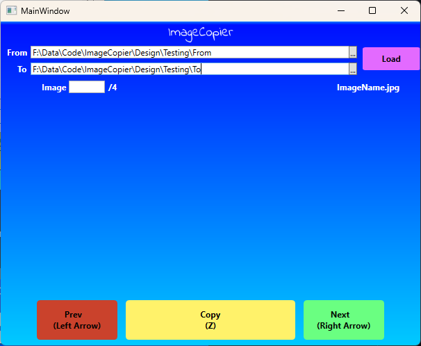
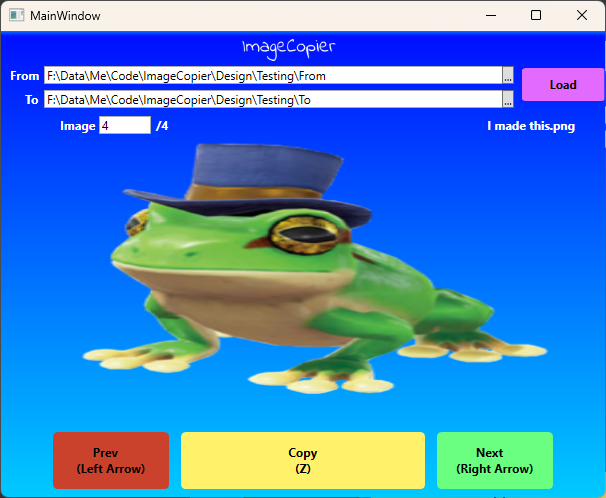

# ImageCopier WPF

> WPF .NET 6.0 GUI app that lets you traverse images under directory A, and copy them into directory B if desired. Tested with up to 2000 images.

This is a WPF version of [ImageCopier](https://github.com/Gayoon1234/ImageCopier)

# Instructions
1. Run the app in Visual Studio code
2. Enter From and To, these are the directories that you are copying from and copying to.
 

3. Select Load button.
4. Use buttons or arrow keys to navigate images. The middle button or space bar is used to copy the image to the "To" directory.
 

